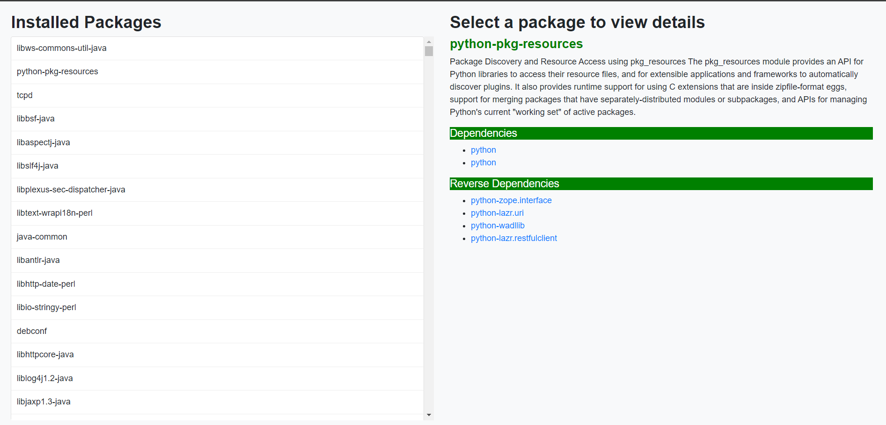

# Package Viewer

This project is a simple web application that displays information about installed packages on a Debian or Ubuntu system. It uses Flask for the backend and Bootstrap for the frontend.

## Features

- Retrieve a list of all installed packages 
- View the details of an installed package, including:
  - Name
  - Description
  - Dependencies 
  - Reverse dependencies

## Prerequisites

- Python 3.6+
- pip (Python package installer)
- A Debian or Ubuntu operating system status file (`/var/lib/dpkg/status` file) [ WINDOWS]

## Setup

1. **Clone the repository:**

   - git clone https://github.com/shivanksinghNL/AgriplaceAssignment.git
   - cd AgriplaceAssignment
   - pip install -r requirements.txt
   - python app.py
2. **Open the web browser:**
- http://localhost:5000/

3. it will look like this :

  